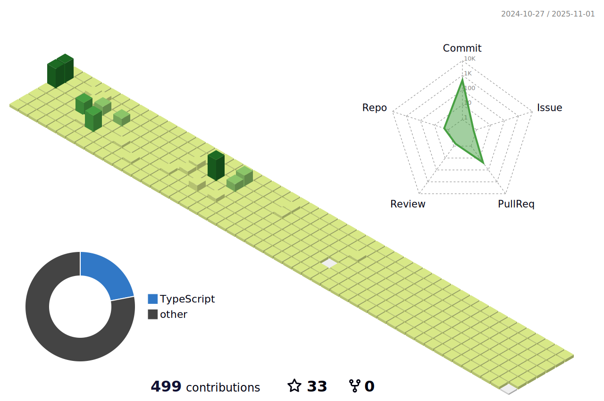

<h1 align="center">Hi 👋, I'm Joel Guerra</h1>

  

  

- 🔭 I’m currently working on [qryn-view](https://github.com/metrico/qryn-view)

- 🌱 I’m currently learning **Go**

<h3 align="left">Connect with me:</h3>

